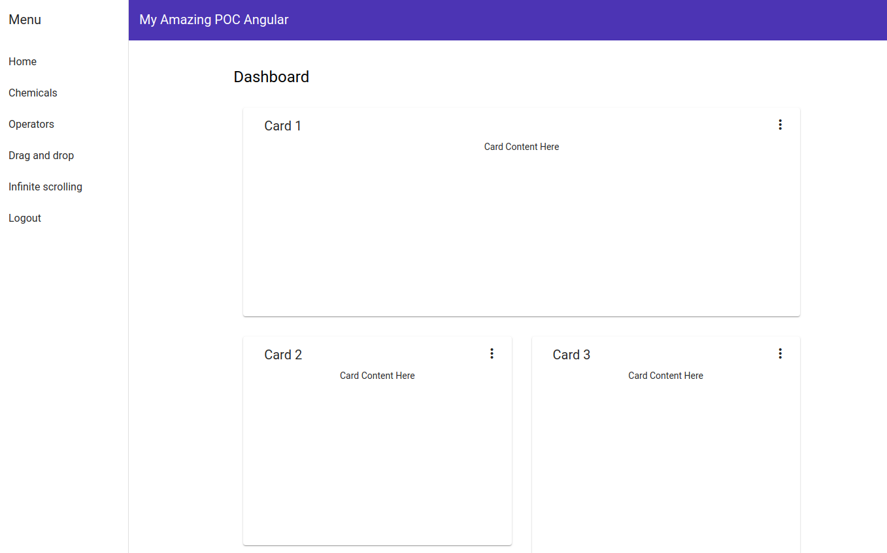

# Angular Challenge

Welcome to the challenge!

Your assignment is awesomely interesting and I am confident that together we can build an amazing demo app based on the [Angular framework](https://angular.io).

This is a how-to guide for setting up a basic Angular application which we will call simply `angular-challenge`.

You will start with the basic concepts of the Angular architecture, and with the help of a number of hands-on excercises become more and more familiar with the wonderful world of Angular.

The learning curve is steep but rewarding, hang in there and take time to check out the reference links to the online documentation which you should carefully review.

Upon successful completion of this challenge, you will have learned about and become adept at the following concepts:

* Install and configure an Angular application
* Create page components and templates
* Angular Material web components (CDK)
* Snackbar, menu, table, dialog box, toolbar, expansion panel, tabs, scrolling, etc.
* Angular Schematics
* Navigation and routing
* Services and RxJS
* Flexbox styling
* Material themes
* HTTPClient and API calls
* Reactive forms
* Authentication using JWT
* Route guards
* HTTP Interceptors
* Linting and testing: ng lint, ng test, ng e2e and cypress

Please focus on the main work and save the sections marked `(optional)` for last, to do if you have time left over.

Good luck.




## Installation

Angular requires Node.js version 8.x or 10.x. For this POC we will be using version 8.x. Ensure that this version is installed:

```
$ node -v
v8.9.3
```

If that is not the case, then go to the [Node Website](https://nodejs.org/en) and follow the instructions for your operating system.

Make sure that you have the latest version of `npm`:

```
$ npm install -g npm@latest
$ npm -v
6.5.0
```

Install the newest version of the Angular CLI:
```
$ npm install -g @angular/cli@latest
$ ng version

Angular CLI: 7.2.1
Node: 8.9.3
...
```

Now you are ready to create the POC application.

```
$ ng new angular-challenge
```

You will be presented with a number of options to choose from, do the following:

- routing? ***yes***
- stylesheet format? ***scss***

Now you can go to the project directory and start the application.

```
$ cd angular-challenge
$ ng serve
```

Go to http://localhost:4200 and you should see the standard Angular "Welcome to angular-challenge!" home page.

Congratulations! You are now ready to move on to bigger and better things.


## Yarn

We will be using the `yarn` package manager instead of `npm` for starting the application and running the `package.json` scripts.

Make sure that it is installed:

```
$ npm install -g yarn
$yarn -v
1.13.0
```

Note that you can delete `package-lock.json` due to the `yarn` warning.


## Home page

Let's now create a standard landing page which is reachable via the `home` route.

We will be setting up all pages as `components` and place then under the `/pages` directory.

```
$ ng g component pages/home
```

Notice that the `HomeComponent` has been added automatically to the `app.module.ts` file:

```
...

import { AppRoutingModule } from './app-routing.module';
import { AppComponent } from './app.component';

import { HomeComponent } from './pages/home/home.component'; // <= Added

@NgModule({
  declarations: [
    AppComponent,
    HomeComponent                                            // <= Added
  ],
  ...
})
export class AppModule { }
```

Go to the `app.component.html` file and remove all contents except for the very last line.

```
<router-outlet></router-outlet>
```

The `<router-outlet>` acts as a placeholder that Angular dynamically fills based on the current router state.

Now we can add the home page to the routing module `app-routing.module.ts` file.

```
import { NgModule } from '@angular/core';
import { Routes, RouterModule } from '@angular/router';

import { HomeComponent } from './pages/home/home.component'; // <= Added

const routes: Routes = [
  { path: '', component: HomeComponent },                    // <= Added
  { path: '**', redirectTo: '', pathMatch: 'full' }          // <= Added
];

@NgModule({
  imports: [RouterModule.forRoot(routes)],
  exports: [RouterModule]
})
export class AppRoutingModule { }
```

The root is now directed to the home component, and anything else `**`.

Now you can fire up the application again and it will be directed the the home page.

```
home works!
```


## Material design

Install Angular Material, CDK and Animations with `yarn`.

```
$ yarn add @angular/material @angular/cdk @angular/animations
```

Import the `BrowserAnimationsModule` into the application by updating the `app.module.ts` module file.

```
import { BrowserModule } from '@angular/platform-browser';
import { NgModule } from '@angular/core';
import { BrowserAnimationsModule } from '@angular/platform-browser/animations'; // <= Added

...

@NgModule({
  ...
  imports: [
    BrowserModule,
    BrowserAnimationsModule,                                                    // <= Added
    AppRoutingModule
  ],
  providers: [],
  bootstrap: [AppComponent]
})
export class AppModule { }

```

Create a shared module to include all of the material modules that you will be using.

```
ng g module modules/material --flat
```

Once the file `modules/material.module.ts` is created, remove the import CommonModule line and include imports/exports of the material modules you will be using.

It should look something like this:

```
import { NgModule } from '@angular/core';

import {
  MatButtonModule,
  MatCardModule,
  ...
  MatTooltipModule
} from '@angular/material';

@NgModule({
  imports: [
    MatButtonModule,
    MatCardModule,
    ...
    MatTooltipModule
  ],
  exports: [
    MatButtonModule,
    MatCardModule,
    ...
    MatTooltipModule
  ]
})
export class MaterialModule {
}

```

This example list should contain only what you actually need, and can be cleaned up later.

Finally, this shared module also has to be made known to the `app.module.ts` module like this.

```
...
import { HomeComponent } from './pages/home/home.component';

import { MaterialModule } from './modules/material.module';  // <= Added

@NgModule({
  ...
  imports: [
    BrowserModule,
    BrowserAnimationsModule,
    MaterialModule,                                          // <= Added
    AppRoutingModule
  ],
  providers: [],
  bootstrap: [AppComponent]
})
export class AppModule { }
```

### Theme

You will want to take advantage of the pre-built material themes by added the following line to the top of your `styles.scss` file.

```
@import "~@angular/material/prebuilt-themes/indigo-pink.css";
```

While we're at it, let's place all of the styles-related files in the `/styles` directory and rename `styles.scss` to `main.scss`:

```
$ mkdir styles
$ mv styles.scss styles/main.scss
```
Since you moved and renamed the main stylesheet, you also need to make this know to Angular. Make the following changes to the `angular.json` file:

``` 
 "build": {
    ...
    "styles": [
              "src/styles/main.scss"        // <= Changed
            ],
 },
 ...
 
 "test": {
    ...
    "styles": [
              "src/styles/main.scss"        // <= Changed
            ],
 },
 
```

### Gestures

In order to include gesture support, you will need to install [HammerJS](https://hammerjs.github.io/).

```
$ yarn add hammerjs
```

After installing, import it on your app's entry point `src/main.ts`. 

```
...
import { environment } from './environments/environment';

import 'hammerjs';    // <= Added

if (environment.production) {
  enableProdMode();
}
...
```

### Icon

Load the material icon font in your `index.html` file by added the following line:

```
<link href="https://fonts.googleapis.com/icon?family=Material+Icons" rel="stylesheet">
```

### Font

We will be using the Google font family `Roboto`, so add the following line to `index.html`:

```
<link href="https://fonts.googleapis.com/css?family=Roboto:300,400,500" rel="stylesheet">
```

And then update `styles/main.scss` by adding the following lines:

```
html, body {
  font-family: 'Roboto', sans-serif;
}

body {
  margin: 0;
}
```


## Schematics

The Angular Material package includes a library of [schematics](https://material.angular.io/guide/schematics) and there is an extensive list of other schematics publically available.

These schematics are like blueprint templates that can be inserted and used in a very flexible way. We will be using the `navigation`,  `dashboard` and `table` schematics to enrich the look-and-feel of the application.

### Navigation

Let's first generate the `navigation` schematic:


```
$ ng generate @angular/material:nav components/navbar
```

A new `NavbarComponent` has been made available and can be used by including it in the `app.component.html` file like this.

```
<app-navbar></app-navbar>
<div class="main-container">
  <router-outlet></router-outlet>
</div>
```

In the `app.component.scss` stylesheet:

```
.main-container {
  margin-left: 200px;
  padding-top: 20px;
  padding-left: 10%;
  padding-right: 10%;
}
```

Fire up the application again (`yarn start`) and have a look. Pretty neat!

See if you can change the boring navigation bar title `angular-challenge` into something more flashy, for example `My Amazing POC Angular`.

### Dashboard

Now we can generate the `dashboard` schematic:

```
$ ng generate @angular/material:dashboard components/dashboard

```

A new `DashboardComponent` has been created for us and can be used on the home page. Change the file `pages/home/home.component.html` file to look like this.

```
<app-dashboard></app-dashboard>
```

Fire up the application again (`yarn start`) and have another look.

### Table

For the `table` schematic we will try something a little different. Let's create a new page and place the table there.

The new page will be called simply `chemicals`, but you can name it anything you want, so generate the page component like this:

```
$ ng g component pages/chemicals
```

We will want to be able to navigate to this page, so it needs to be added. Add an extra route to the `app-routing.module.ts` file:

```
...
import { HomeComponent } from './pages/home/home.component';
import { ChemicalsComponent } from './pages/chemicals/chemicals.component';  // <= Added

const routes: Routes = [
  { path: '', component: HomeComponent },
  { path: 'chemicals', component: ChemicalsComponent },                      // <= Added
  { path: '**', redirectTo: '', pathMatch: 'full' }
];

@NgModule({
  imports: [RouterModule.forRoot(routes)],
  exports: [RouterModule]
})
export class AppRoutingModule { }
```

Now you should be able to go to this page via http://localhost:4200/chemicals and see:

```
chemicals works!
```

Now we can generate the `table` schematic:

```
$ ng generate @angular/material:table components/table
```

Let's insert the TableComponent on the page and see what happens. Edit the `pages/chemicals/chemicals.component.html` file so it looks like this:

```
<app-table></app-table>
```

Add the `TableComponent` to the imports section of `app.module.ts` like this:

```
...
import { ChemicalsComponent } from './pages/chemicals/chemicals.component';
import { TableComponent } from './components/table/table.component';          // <= Added

@NgModule({
  declarations: [
    ...
    TableComponent,                                                           // <= Added
    ChemicalsComponent
  ],
  providers: [],
  bootstrap: [ AppComponent ]
})
export class AppModule {
}

```


## Router Links

We can now update the links in the side menu to take us to the `home` and `chemicals` page.

This is accomplished by using the [routerLink directive](https://angular.io/guide/router#router-links). Go to the `components/navbar/navbar.component.html` file and make the following changes.

```
<mat-sidenav-container class="sidenav-container">
  ...
    <mat-toolbar>Menu</mat-toolbar>
    <mat-nav-list>
      <a mat-list-item routerLink="home">Home</a>
      <a mat-list-item routerLink="chemicals">Chemicals</a>
    </mat-nav-list>
  </mat-sidenav>
  ...
</mat-sidenav-container>
```

Try it and make sure it works.


## Flexbox

Flexbox is a new layout mode for CSS3, providing a one-dimensional layout model, offering sophisticated space distribution between items in an interface and powerful alignment capabilities.

Angular implements flexbox seamlessly by using the [flex-layout](https://github.com/angular/flex-layout) package. In order to install it, run the following command:

```
$ yarn add @angular/flex-layout

```

Then import it in the `src/app/app.module.ts` module:

```
import { BrowserModule } from '@angular/platform-browser';
import { NgModule } from '@angular/core';
import { BrowserAnimationsModule } from '@angular/platform-browser/animations';
import { FlexLayoutModule } from '@angular/flex-layout';    // <= Added

...

@NgModule({
  ...
  imports: [
    ...
    FlexLayoutModule,                                       // <= Added
    MaterialModule,
    ...
  ],
  providers: [],
  bootstrap: [ AppComponent ]
})
export class AppModule {
}
```

For more detailed information, you might want to check out the following:
* [A Guide to Flexbox](https://css-tricks.com/snippets/css/a-guide-to-flexbox) 
* [Layout demos](https://tburleson-layouts-demos.firebaseapp.com/#/docs)


## HTTPClient

The HTTPClient module provides communication with back-end API servers in a seamless and easy to use way.

Our API server will be available at `http://localhost:3000/api/v1`. In order to enable it, include it in the `app.module.ts` module as follows:

```
import { HttpClientModule } from '@angular/common/http';

@NgModule({
  imports: [
    BrowserModule,
    // import HttpClientModule after BrowserModule.
    HttpClientModule,
  ]
```

The HTTP service can now be injected in our component class constructors to provide the required functionality.


## Service

We will now create a service to connect to the backend api, whose job will be to provide CRUD actions for operators. For the time being, we will only concern ourselves with GET.

Generate the new service in the `services` directory:

```
$ ng g service services/operator
```

Have a look at the new `services/operator.service.ts` file:

```
import { Injectable } from '@angular/core';

@Injectable({
  providedIn: 'root'
})
export class OperatorService {

  constructor() { }
}
```

Note the use of `providedIn: 'root'` metadata option in the `@Injectable()` decorator. No need to exclicitly include it in the `app.module.ts` as this option does it automatically. See [Dependency Injection in Angular](Dependency Injection in Angular) for more information.

In the constructor of the `OperatorService` module, we inject the `HttpClient` service as follows:

```
import { Injectable } from '@angular/core';
import { HttpClient } from '@angular/common/http';              // <= Added

@Injectable({
  providedIn: 'root'
})
export class OperatorService {

  constructor(private http: HttpClient) { }                     // <= Changed
}
```

### User model

If you looked closely at the response, you will see that each operator element also includes a list of users belonging to the operator.

```
[
  {
    "id": "b5ec2e97-641d-43d6-b891-fed0a5a92685",
    "code": "TRUPHONE",
    "name": "Truphone",
    "users": [
      {
        "id": "8c754253-a5d2-4e32-9b43-55917e56724f",
        "username": "admin@example.org",
        "name": "Bender Rodriguez",
        "role": "admin"
      },
      ...
      {
        "id": "7f055989-a7a6-4664-973a-dfac5e10e8b4",
        "username": "Cortez24@gmail.com",
        "name": "Cortez Anderson",
        "role": "user"
      }
    ]
  }
```

Let's see if we can also extract the users and display them on the operators page.

First create the `services/user.model.ts` user model:

```
export interface IUser {
  id: string;
  name: string;
  username: string;
  role: string;
}
```

Now include this field in the `services/operator.model.ts` operator model:

```
import { IUser } from './user.model';           // <= Added

export interface IOperator {
  ...
  users: IUser[];                               // <= Added
}
``` 

Add a `getUserNames()` method to the `OperatorsComponent` like this:

```
...
export class OperatorsComponent implements OnInit {

  ...

  getUserNames(operator: IOperator): string[] {
    return operator.users.map(user => user.name);
  }
}
```

The user list has now been made available for listing the operators on the `operators.html.ts` page:

```
<ul>
  <li *ngFor="let operator of operators$ | async">
    {{operator.code}} | {{operator.name}}
    | {{getUserNames(operator).join(', ')}}               // <= Added
  </li>
</ul>
```

Now when you visit the operators page you should see the users listed next to each operator.

### Expansion Panel component

In order to illustrate the power of the Material CDK (Components Development Kit), we will beautify the operators page by using the [Expansion Panel](https://material.angular.io/components/expansion/overview).

Make sure that you have the expansion module added to the `modules/material.module.ts`

```
import { MatExpansionModule } from '@angular/material/expansion';
```

as well as added to the `imports` and `exports` sections.

Now you can implement the accordion by inserting the `<mat-accordion>` component in the `operators.component.html` file.

```
<mat-accordion>
  <mat-expansion-panel *ngFor="let operator of operators$ | async">
    <mat-expansion-panel-header>
      <mat-panel-title>
        {{operator.code}} | {{operator.name}}
      </mat-panel-title>
    </mat-expansion-panel-header>
    <p *ngFor="let user of operator.users">{{user.username.toLowerCase()}} | {{user.name}}</p>
  </mat-expansion-panel>
</mat-accordion>
```

Pretty fancy, don't you think?!

### Tabs component

The [Tab component](https://material.angular.io/components/tabs/overview) allows you to organize content into separate views where only one view can be visible at a time.

Let's improve the operators page to include two tabs, one displaying the content we just implemented, and a new tab for a table.

As usual, make sure that you import the tabs module in the `material.module.ts` file:

```
import { MatTabsModule } from '@angular/material/tabs';
```

Insert the template content between the tabs in the `operator.component.html` template file like this:

```
<mat-tab-group>
  <mat-tab label="Table">
     <ng-container *ngTemplateOutlet="table"></ng-container>
  </mat-tab>
  <mat-tab label="Listing">
    <ng-container *ngTemplateOutlet="listing"></ng-container>
  </mat-tab>
</mat-tab-group>

<ng-template #table>
  Table goes here ...
</ng-template>

<ng-template #listing>
  <mat-accordion>
    <mat-expansion-panel *ngFor="let operator of operators$ | async">
      <mat-expansion-panel-header>
        <mat-panel-title>
          {{operator.code}} | {{operator.name}}
        </mat-panel-title>
      </mat-expansion-panel-header>
      <p *ngFor="let user of operator.users">{{user.username.toLowerCase()}} | {{user.name}}</p>
    </mat-expansion-panel>
  </mat-accordion>
</ng-template>
```

Here we are making use of [Template Outlets](https://angular.io/api/common/NgTemplateOutlet) which offers a powerful means of dynamically inserting content on a page. You can even enable lazy loading of the content if required.

Now you should see two tabs, please verify.

### Data Table component

The [Data Table](https://material.angular.io/components/table/overview) is a very powerful web component which can be used easily and effectively.

In the `operator.component.html` template file, replace `Table goes here...` with the following content:

```
 <section class="mat-elevation-z8">

    <table width="100%" mat-table [dataSource]="dataSource" matSort>

      <ng-container *ngFor="let column of displayedColumns" [matColumnDef]="column">
        <th mat-header-cell *matHeaderCellDef mat-sort-header>{{column}}</th>
        <td mat-cell *matCellDef="let element">{{element[column]}}</td>
      </ng-container>

      <tr mat-header-row *matHeaderRowDef="displayedColumns"></tr>
      <tr mat-row *matRowDef="let row; columns: displayedColumns;"></tr>
    </table>

    <mat-paginator #paginator [pageSize]="pageSize" [pageSizeOptions]="pageSizeOptions"
                   showFirstLastButtons></mat-paginator>
  </section>
```

In order to hook the data table, edit the `operators.component.ts` file to look like this:

```
import { AfterViewInit, Component, OnInit, ViewChild } from '@angular/core';
...
import {MatTableDataSource, MatPaginator, MatSort} from '@angular/material';

interface IRowOperator {
  id: string;
  code: string;
  name: string;
  users: number;
}

...
export class OperatorsComponent implements OnInit, AfterViewInit {

  ... 
  
  displayedColumns: string[] = [ 'id', 'code', 'name', 'users' ];
  dataSource = new MatTableDataSource<IRowOperator>();

  pageSize = 10;
  pageSizeOptions = [ 10, 25, 50, 100 ];

  @ViewChild(MatSort) sort: MatSort;
  @ViewChild(MatPaginator) paginator: MatPaginator;

  constructor(private operatorService: OperatorService) {
  }

  ngOnInit() {
    this.operators$ = this.operatorService.getAll();
    this.operators$.subscribe(operators => this._setDataSourceData(operators));
  }

  ngAfterViewInit() {
    this.dataSource.sort = this.sort;
    this.dataSource.paginator = this.paginator;
  }
  ...
  
  _setDataSourceData(operators: IOperator[]) {
    this.dataSource.data = operators.map(operator => {
      return {
        id: operator.id,
        code: operator.code,
        name: operator.name,
        users: operator.users.length
      };
    });
  }
}
```

So far so good.

### Filter

Let's include a filter so that we can enter a string and filter the data table based on the filter string.

Insert at the top of the `#table template` the filter input element, each key-down event sending the filter string to the `applyFilter()` method.

```
<ng-template #table>

  <div fxLayoutAlign="start center">
    <mat-form-field fxFlex="50%">
      <input matInput (keyup)="applyFilter($event.target.value)" placeholder="Filter">
    </mat-form-field>
  </div>

  <section class="mat-elevation-z8">
```

Make sure that both the `MatFormFieldModule` AND `MatInputModule` are added to the `material.module.ts` module.

In the `operators.component.ts` module file we define the `applyFilter()` method as follows:

```
 applyFilter(filterValue: string) {
    this.dataSource.filter = filterValue.trim().toLowerCase();
  }
```

For more information, check out the [Data Table Documentaion](https://material.angular.io/components/table/overview).


## Users page (optional)

As an extra optional excercise, see if you can create a users page based on the operators page. Don't forget that you will need to generate a new user service as well as a user component.


## Auth service

It's time to add some authorization so that we can login to the backend. This will be based on [Jason Web Tokens](https://jwt.io).

You will first have to login to the backend using a valid username and password, after which if successful you will receive a token.

This token must be saved and for all following request be included in the HTTP header:

```
 { 'Authorization': 'Bearer TOKEN' }
```

Let's start by creating an auth service:

```
 ng g service services/auth
```

For logging in we will expose a `login()` method, for the time being simply a dummy method always accepting the login and navigating to the home page.

Make the following changes to the `services/auth.service.ts` file:

```
import { Injectable } from '@angular/core';
import { Router } from '@angular/router';             // <= Added

@Injectable({
  providedIn: 'root'
})
export class AuthService {

  constructor(private router: Router) {               // <= Added
  }

  login(username: string, password: string): void {   // <= Added
    this.router.navigate([ '/' ]);
  }
}
```


## Login

Until now we have been freely able to make any server api call without authorization. Now this will change, and we will start by creating a login page.

```
$ ng g component pages/login
```

and add the new login route to `app-routing.module.ts`:

```
import { LoginComponent } from './pages/login/login.component';

const routes: Routes = [
  ...
  {path: 'login', component: LoginComponent},
```
  
You should now be able to see the new page at `http://localhost:4200/login.

```
login works!
```  

### Form

Edit the `pages/login/login.compoment.ts` component file to look like the following:

```
import { Component, OnInit } from '@angular/core';
import { FormGroup, Validators, FormBuilder } from '@angular/forms';

import { AuthService } from '../../services/auth.service';

@Component({
  selector: 'app-login',
  templateUrl: './login.component.html',
  styleUrls: [ './login.component.scss' ]
})
export class LoginComponent implements OnInit {
  loginForm: FormGroup;

  constructor(private authService: AuthService,
              private fb: FormBuilder) {
  }

  ngOnInit() {
    this.loginForm = this.fb.group({
      email: [ '', [ Validators.required, Validators.email ] ],
      password: [ '', [ Validators.required, Validators.minLength(5) ] ]
    });
  }

  onSubmit() {
    this.authService.login(this.loginForm.value.email, this.loginForm.value.password);
  }

  getInputError(name: string): string {
    const errors = this.loginForm.controls[name].errors;
    if (errors) {
      if (errors.required) {
        return 'Required';
      } else if (errors.minlength) {
        return `Minimum length is ${errors.minlength.requiredLength} `;
      } else {
        return JSON.stringify(errors);
      }
    }
    return '';
  }
}
```

Since we are using reactive forms, we need to import the extra module in the `app.module.ts` file and add them to the imports section:

```
...
import { FormsModule, ReactiveFormsModule } from '@angular/forms';

...

@NgModule({
  ...
  imports: [
    ...
    FormsModule,
    ReactiveFormsModule,
    ...
  ],
  ...
})
export class AppModule {
}
```

I won't go into more details, but good documentation can be found in [Introduction to forms in Angular](https://angular.io/guide/forms-overview).

Now for the `login.component.html` page:

```
<section fxLayoutAlign="center">
  <mat-card class="mat-elevation-z8">
    <mat-card-header fxLayoutAlign="center">
      <mat-card-title>Login</mat-card-title>
    </mat-card-header>
    <form [formGroup]="loginForm" (ngSubmit)="onSubmit()">
      <mat-card-content fxLayout="column" fxLayoutAlign="center center" fxLayoutGap="10px">
        <mat-form-field>
          <input
            type="email"
            matInput
            placeholder="Email"
            formControlName="email">
          <mat-error>{{getInputError('email')}}</mat-error>
        </mat-form-field>
        <mat-form-field>
          <input
            type="password"
            matInput
            placeholder="Password"
            formControlName="password">
          <mat-error>{{getInputError('password')}}</mat-error>
        </mat-form-field>
      </mat-card-content>
      <mat-card-actions fxLayoutAlign="center">
        <button type="submit" mat-raised-button color="primary" 
          [disabled]="loginForm.invalid">
          Submit
        </button>
      </mat-card-actions>
    </form>
  </mat-card>
</section>
```

Notice the use of flex-layout directives to center and align the login elements. The submit button is enabled when both the username and password fields contain valid contents, and the `onSubmit()` method passes these credential to the auth service.

To make it look even better, add the following styles to the `login.component.scss` file:

```
mat-card {
  margin-top: 20px;
  width: 400px;
}

mat-card-title {
  font-weight: bold;
  font-size: larger;
}

mat-form-field {
  width: 350px
}
```

### Auth login service

Let's now see if we can extent the auth login method to make an actual call to the backend.

```
import { HttpClient } from '@angular/common/http';                  // <= Added

@Injectable({
  providedIn: 'root'
})
export class AuthService {

  constructor(private router: Router,
              private http: HttpClient) {                           // <= Added
  }

  login(username: string, password: string): void {
    const url = 'http://localhost:3000/api/v1/login';
    this.http
      .post(url, {username, password}).subscribe((data: any) => {   // <= Added
        console.log(data);
        this.router.navigate([ '/' ]);
      },
      error => {
        console.error(error);
      });
  }
}
```

Login with valid credentials `admin@example.org/admin` and inspect the console output.

Now login with invalid credentials and see what happens.

The data response object (RO) returned by the backend api service is jason and has a well-defined structure. Define an interface for the `auth.service.ts` file to describe it:

```
interface ILoginRO {
  user: {
    id: string;
    name: string;
    username: string;
    role: string;
  };
  token: string;
}
```

And replace `(data: any)` with `(data: ILoginRO)`. This allows you to a`ccess the token in the returned data and save it for later to be accessed by a new service method called `getToken()`. Logging out will simply mean resetting the token to null.

```
export class AuthService {

  private token: string = null;                                   // <= Added

  constructor(private router: Router,
              private http: HttpClient) {
  }

  login(username: string, password: string): void {
    const url = 'http://localhost:3000/api/v1/login';
    this.http
      .post(url, {username, password}).subscribe((data: ILoginRO) => {
        console.log(data);
        this.token = data.token;                                  // <= Added
        this.router.navigate([ '/' ]);
      },
      error => {
        console.error(error);
        window.alert('Invalid credentials, please try again.');  // <= Added
      });
  }

  getToken(): string {                                            // <= Added
    return this.token;
  }

  logout(): void {                                                // <= Added
    this.token = null;
    this.router.navigate([ '/login' ]);
  }
}
```

### Route Guard

We will now implement a [route guard](https://angular.io/guide/router#milestone-5-route-guards) called `AuthGuard` that will redirect any user who is not logged in to the login page.

```
$ ng g guard /auth
```

Inject the `AuthService` and update the `canActivate()` method in the `services/auth.guard.ts` file:

```
...
import { AuthService } from './auth.service';

@Injectable({
  providedIn: 'root'
})
export class AuthGuard implements CanActivate {
  constructor(private authService: AuthService, private router: Router) {
  }

  canActivate(...) {
    if (this.authService.getToken()) {
      return true;
    } else {
      this.router.navigate([ '/login' ]);
      return false;
    }
  }
}

```

If the user is logged in (e.g. token is not null) then the `canActivate()` method returns true, otherwise false.

We can implement the `AuthGuard` in the `app-routing.module.ts` file like this:

```
...
import { AuthGuard } from './services/auth.guard';

const routes: Routes = [
  {path: '', component: HomeComponent, canActivate: [AuthGuard]},
  {path: 'login', component: LoginComponent},
  {path: 'chemicals', component: ChemicalsComponent, canActivate: [AuthGuard]},
  {path: 'operators', component: OperatorsComponent, canActivate: [AuthGuard]},
  {path: '**', redirectTo: '', pathMatch: 'full'}
];

@NgModule({
  imports: [ RouterModule.forRoot(routes) ],
  exports: [ RouterModule ],
  providers: [AuthGuard]
})
export class AppRoutingModule {
}
```

Notice that all the routes except for `login` are now guarded from users who have not already logged in.

Let's now display two side menu modes depending on whether or not the user is logged in. Again, we will check out the value of token.

The auth service needs to implement a [ReactiveX Subject](https://rxjs-dev.firebaseapp.com/guide/subject) using the [rxjs library](https://angular.io/guide/rx-library).

We will call this the `changedToken` made available by the `AuthService` so that other components can subscribe for changes.

When the user logs in or out, the listeners will be notified via `changedToken.next(this.token)` calls. We will add this to the login and logout methods:

```
...
import { Subject } from 'rxjs';                       // <= Added

...
export class AuthService {

  changedToken = new Subject<string>();               // <= Added
  ...

  login(username: string, password: string): void {
    const url = 'http://localhost:3000/api/v1/login';
    this.http
      .post(url, {username, password}).subscribe((data: ILoginRO) => {
        ...
        this.changedToken.next(this.token);           // <= Added
        this.router.navigate([ '/' ]);
      });
  }

  ... 
  
  logout(): void {
    this.token = null;
    this.changedToken.next(null);                     // <= Added
    this.router.navigate([ '/login' ]);
  }
}
```

Now the navigation module can now listen for changes and reset the `loggedIn` toggle appropriately.

Give it a try and make sure that it works as expected.

### HTTP Interceptor

The final step towards completed the authorization flow is to ensure that all requests to the backend include a token header with the following format:

```
{ 'Authorization': 'Bearer TOKEN' }
```

The proper way to ensure this is to intercept all outgoing requests and insert the required header. This can be accomplished using an angular [HttpInterceptor](https://angular.io/api/common/http/HttpInterceptor).

First generate an http interceptor called `TokenInterceptor`:

```
$ touch src/app/services/token.interceptor.ts
```

Edit the file `token.interceptor.ts` so it looks like this:

```
import { Injectable } from '@angular/core';
import { HttpRequest, HttpHandler, HttpEvent, HttpInterceptor } from '@angular/common/http';
import { Observable } from 'rxjs';

import { AuthService } from './auth.service';

@Injectable()
export class TokenInterceptor implements HttpInterceptor {
  constructor(public auth: AuthService) {
  }

  intercept(request: HttpRequest<any>, next: HttpHandler): Observable<HttpEvent<any>> {

    const token = this.auth.getToken();

    if (token) {
      request = request.clone({ setHeaders: { Authorization: `Bearer ${token}` } });
    }

    return next.handle(request);
  }
}
```

This new provider needs to be added to the `app.modules.ts` file for it to be available to the app.

```
import { TokenInterceptor } from './services/token.interceptor';

@NgModule({
  ...
  providers: [
    OperatorService,
    {provide: HTTP_INTERCEPTORS, useClass: TokenInterceptor, multi: true}
  ],
  bootstrap: [ AppComponent ]
})
```

Make a new request for operators and you will see that the token header is now included.

### Enable authorization 

Returning to the backend server, stop it if it is running, and enable authorization on the backend by changing the following line in the `server/.env` file:

```
API_AUTH=true
```

Restart the server:

```
$ yarn start:dev
...
[AppModule] API => {"host":"http://localhost","port":3000,"prefix":"api/v1","auth":true, ... }
```

Restart the client application, login and go to the operators page again to ensure it is running.

Congratulations, you have now successfully enabled jwt authentication!


## Snackbar component

The [Snackbar](https://material.angular.io/components/snack-bar/overview) service allows one to display snack-bar notifications for certain events that need to be made visible to the user.

Let's implement a snackbar for when the user logins in successfully.

First make sure that the `MatSnackBarModule` is imported in the `material.module.ts` file.

Then in the `auth.service.ts` file:

```
import { MatSnackBar } from '@angular/material';                        // <= Added

  ...
  constructor(private router: Router,
              private snackbar: MatSnackBar,                            // <= Added
              private http: HttpClient) {
  }
  
    ...
    this.snackbar.open('Login successful', 'X', { duration: 5000 });    // <= Added
    this.router.navigate([ '/' ]);
  
```


## Dialog service (optional)

As an extra optional excercise, consider the [Dialog service](https://material.angular.io/components/dialog/overview) can be used to open modal dialogs with Material Design styling and animations.

We will now replace the `window.alert('Invalid credentials, please try again.')` call in the auth service with a more elegant prompt dialog box.

```
$ ng g component dialogs/prompt-dialog
```

Edit the `dialogs/prompt-dialog/prompt-dialog.component.ts` component file to look like this:

```
import { Component, Inject, OnInit } from '@angular/core';                // <= Added (Inject)
import { MAT_DIALOG_DATA } from '@angular/material';                      // <= Added

export interface IPromptDialogData {                                      // <= Added
  title: string;
  subtitle: string;
  message: string;
}

...
export class PromptDialogComponent implements OnInit {

  constructor(@Inject(MAT_DIALOG_DATA) public data: IPromptDialogData) { // <= Added
  }
  ...
}
```

Edit the `dialogs/prompt-dialog/prompt-dialog.component.html` template file to look like this:

```
<h2 mat-dialog-title>{{data.title}}</h2>
<div mat-dialog-content class="mat-typography">
  <h3>{{data.subtitle}}</h3>
  <p>{{data.message}}.</p>
</div>
<div mat-dialog-actions align="end">
  <button mat-raised-button mat-dialog-close>OK</button>
</div>
```

Note the use of the `IPromptDialogData` interface to enable typescript checking.

Now that we have a dialog reference defined, we can use it in the `logout()` method of the auth service.

Try and figure out how to do this.


## UI service (optional)

As an extra optional excercise, implement a new UI service that provides the following three user-interface methods:

* showSnackbar(message: string): void
* prompt(message: string): Observable<boolean>
* confirm(message: string): Observable<boolean>


## Logout (optional)

As an extra optional excercise, see if you can implement a logout mechanism by including link on the side menu. Only show the logout link when the user has logged in.

Hint #1:

```
// navbar.compoment.ts

onLogout() {
  this.auth.logout();
}
```

Hint #2:

```
// navbar.compoment.html

<mat-nav-list *ngIf="loggedIn">
  ...
  <a mat-list-item (click)="onLogout()">Logout</a>
</mat-nav-list>
```

Extra challenge: implement a snack-bar message `Logout successful` as you did for the login.

Another extra challenge: prompt the user with an `Are you sure?` message first with yes and no buttons..


## Config service (optional)

As an extra optional excercise, implement a new configuration service that provides a global collection of the enviroment and other configuration settings.

Hint: Have a look at [dotenv](https://www.npmjs.com/package/dotenv).

Replace the hard-coded references to `http://localhost:3000/api/v1` with a better parameterized service call.


## Local storage (optional)

As an extra option excercise, implement local storage to save the token so that during refresh and/or between sessions the user remains logged in.

On successfull login, save the user object as well and display the user's name in the toolbar.


## Themes

Angular material allows you to define your own color schemes. Read the [Theming Guide](https://material.angular.io/guide/theming) and create a user-defined `theme.scss` file based on the "typical theme file" mentioned in the guide.

```
$ touch  src/theme.scss
```

and import it from the `styles.scss` file

```
@import "~@angular/material/prebuilt-themes/indigo-pink.css";
@import "./theme.scss";
```

Play around with the color macros and palettes and observe the changes.

### Look and feel (optional)

As an extra optional excercise, use the above information about themes, see if you can re-create the COMPANY look-and-feel by reading the COMPANY house stule guide.
 
based on the following:

```
primary:   #265277 (darkslategray)
secondary: #e49637 (golden rod)
tertiary:  #2d3a3e (gray)

logo:      src/assets/images/logo.png
favicon:   src/assets/images/favicon.png
```

For example, place the logo in the toolbar and see if you can mimic the styling on the COMPANY home page.


## About page

Create a new page component called `AboutComponent`, add it to the `app-routing.module.ts` module, add a new link to this page in the side menu, and use `RouterLink` to change to the about page when the link is clicked.


## Drag and drop (optional)

As an extra optional excercise, see if you can create a new page which demonstrates the [Drag and Drop Component](https://material.angular.io/cdk/drag-drop/overview)

Hint: see the `drag-and-drop` page component. Don't forget to import the `DragDropModule` and `DragAndDropComponent` in the `app.module.ts` file and include them in the imports and declarations sections, respectively.

```
import { DragDropModule } from '@angular/cdk/drag-drop';
...
import { DragAndDropComponent } from './pages/drag-and-drop/drag-and-drop.component';

declarations: [
  DragAndDropComponent
],
imports: [
  DragDropModule
]
```


## Infinite scrolling (optional)

As an extra optional excercise, see if you can create a new page which demonstrates [Virtual scrolling](https://material.angular.io/cdk/scrolling/overview).

Hint: see the `infinite-scrolling` page component. Don't forget to import the `ScrollingModule` and `InfiniteScrollingComponent` in the `app.module.ts` file and include it in the imports and declarations sections, respectively

```
import { ScrollingModule } from '@angular/cdk/scrolling';
...
import { InfiniteScrollingComponent } from './pages/infinite-scrolling/infinite-scrolling.component';

declarations: [
  InfiniteScrollingComponent
],
imports: [
  ScrollingModule
]
```

Also, you will need [fakerJS](https://github.com/marak/Faker.js) library to generate a long list of names.

```
$ yarn add faker
```

More information can be found here:
* [Angular 7 Virtual Scroll - To Infinity and Beyond](https://www.youtube.com/watch?v=Ppl64MY6FFc)
* [Infinite Virtual Scroll With the Angular CDK](https://angularfirebase.com/lessons/infinite-virtual-scroll-angular-cdk)
* [Source code on github](https://github.com/AngularFirebase/145-infinite-virtual-scroll-cdk-angular)


## Token expiration (optional)

By default the token `ExpiresIn` value is set to 30 minutes. This means that after 30 minutes all normally valid HTTP requestes will return an error.

If this happens, the user will have to login again in order to ask for a renewed token.

As an extra optional excercise, implements this either using a timer or detecting the HTTP error and thereafter notifying the user that he has been logged out and has to login it again, e.g. redirect to the login page.


## Docker (optional)

This is an optional placeholder explaining how to dockerize the application.


## HMR (optional)

Hot Module Replacement (HMR) is a [WebPack feature](https://webpack.js.org/guides/hot-module-replacement) to update code in a running app without rebuilding it. 

This results in faster updates and less full page-reloads. For more complex projects this makes a huge difference in the development cycle time.

As an extra optional excercise, read [Configure Hot Module Replacement](https://github.com/angular/angular-cli/wiki/stories-configure-hmr) on how to install and configure it.


## Testing

There are two modes of testing: unit testing at the component level and end-to-end (E2E) testing at system level.

### Unit testing

For the unit testing, we want to run the tests in headless mode.

Add the following script to the `package.json` file:

```
"scripts": {
  ...
  "test": "ng test",
  "test-headless": "ng test --watch=false --browsers=ChromeHeadless",
}
```

Unit testing for Angular is built in out of the box, simply execute the following command:

```
$ yarn test
```

Since you do not want to include the underlying angular components, don't forget to add a schemas section within `@NgModule()`:

```
  schemas: [ NO_ERRORS_SCHEMA ]
```

### E2E testing

As in the unit tests, let's emable headless mode.

We need to modify the capabilities entry in the `e2e/protractor.conf.js` file to include a `chromeOptions` object like this:

```
capabilities: {
  chromeOptions: {
    args: [ "--headless" ]
  },
  'browserName': 'chrome'
},
```

Finally, run the tests like this:

```
$ yarn e2e
```

## Cypress testing

Instead of using the default e2e tests, we can take advantage of the more advanced features available in [Cypress](https://www.cypress.io). You will first need to [install Cypress](https://docs.cypress.io/guides/getting-started/installing-cypress.html).

```
$ yarn add -D cypress
```

Add the following extra scripts to the `package.json` file:

```
{
  "scripts": {
    ...
    "e2e": "ng e2e",
    "cypress:open": "cypress open",
    "cypress:run": "cypress run"
  }
}
```

Now you can run Cypress for the first time:

```
$ yarn cypress:open
```

Simply wait until the Cypress GUI window has opened and close immediately.

You will notice that a `/cypress` directory has been created in the project root with a number of pre-installed example tests.

Remove these test so that you can start afresh:

```
$ rm -rf cypress/integration/examples
```

Notice that an empty `cypress.json` configuration file has also been created. This is where we can define a number of parameters to modify the behavior of Cypress.

See the [Cypress Configuration](https://docs.cypress.io/guides/references/configuration.html) for more information.

For the time being we will be happy with only defining the base url:

```
{
  "baseUrl": "http://localhost:4200"
}
```

You now have an empty integrations directory in which to define new tests. Let's start with the first test `login_page_spec` which will validate that the login page is working.

```
$ mkdir cypress/integration/pages
$ touch cypress/integration/pages/login_page_spec.js
```

Start with a dummy test by modifying the `login_page_spec.js` file to look something like the this:

```
describe('Login page', function() {
  it('should be redirected to the login page', function() {
    expect(true).to.equal(true)
  })
})
```

Run the test:

```
$ yarn cypress:open
```

Click on the `pages/login_page_spec.js` link to fire off the test, and it should pass (green).

Time for a real test. We want to verify that when the user first goes to the home page that he is redirected to the login page (since he hasn't logged in yet).

Let's try the following:

```
describe('Login page', function() {
  it('should be redirected to the login page', function() {
    cy
      .visit('/')
      .url().should('contain', '/login')
  })
});
```

Notice the uses of [chains of commands](https://docs.cypress.io/guides/core-concepts/introduction-to-cypress.html#Chains-of-Commands) and [should](https://docs.cypress.io/api/commands/should.html).


## Lint

```
$ yarn lint
yarn run v1.13.0
$ ng lint
Linting "angular-challenge"...
All files pass linting.
Linting "angular-challenge-e2e"...
All files pass linting.
```


## Cleanup

Not yet quite squeaky clean, but getting ever closer, some cleanup is still in order.

The table schematic inserted a number of Mat-modules in the `app.module.ts` module, but these should be move to the `material.module.ts` module.


## References

Here are a number of links that you may find useful:

* [Angular Documentation](https://angular.io/docs)
* [Angular CLI](https://github.com/angular/angular-cli/wiki)
* [Material Design](https://material.angular.io)
* [Material Schematics](https://material.angular.io/guide/schematics)
* [Flex-Layout for Angular](https://github.com/angular/flex-layout)
* [A Guide to Flexbox](https://css-tricks.com/snippets/css/a-guide-to-flexbox)
* [Quick Start Angular Material and Flex-Layout](https://medium.com/letsboot/quick-start-with-angular-material-and-flex-layout-1b065aa1476c)
* [HammerJS](https://hammerjs.github.io)
* [Rxjs library](https://angular.io/guide/rx-library)
* [Jason Web Tokens (JWT)](https://jwt.io)
* [FakerJS](https://github.com/marak/Faker.js)
* [Cypress End-to-end Testing Framework](https://www.cypress.io)
* [Hot Module Replacement](https://webpack.js.org/guides/hot-module-replacement)
* [Enabling HMR in Angular](https://theinfogrid.com/tech/developers/angular/enabling-hot-module-replacement-angular-6)

If you're interested in learning more about how the server was built:

* [NestJS](https://nestjs.com)
* [Developing Backend APIs with Nest.js](https://auth0.com/blog/full-stack-typescript-apps-part-1-developing-backend-apis-with-nestjs)
* [JWT](https://github.com/nestjs/jwt)
* [Typeorm](https://github.com/typeorm/typeorm)
* [Migrations](https://github.com/typeorm/typeorm/blob/master/docs/migrations.md)
* [PassportJS](http://www.passportjs.org)
* [Faker](https://github.com/marak/Faker.js)
* [AutomapperTS](https://github.com/loedeman/AutoMapper/wiki/Getting-started)
* [Config](lorenwest/node-config)


## Authors

Kiffin Gish
